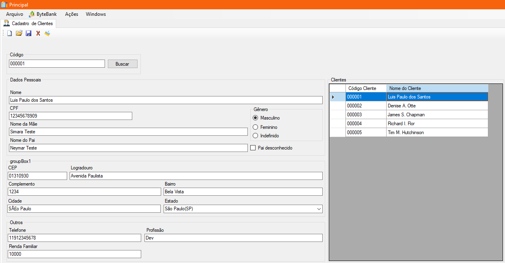
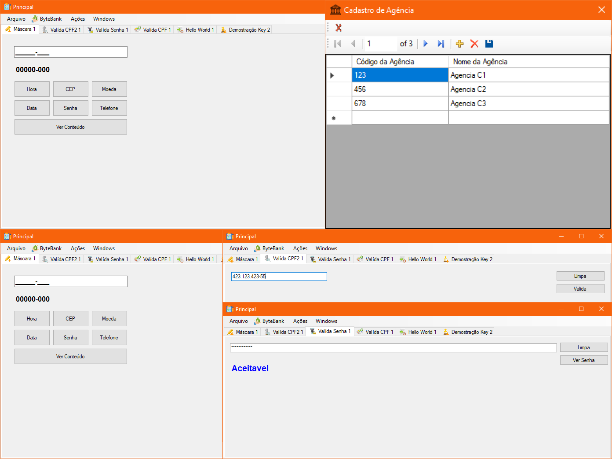

# Windows Form

- [Introduction](#introduction)
- [Technologies](#technologies)
- [Features](#features)
  
## Introduction

This is my first project using **`Windows Forms with C#`**, where I explored various methods to create a user interface. The project began with an application that used local storage with files and later transitioned to a database using *SQL Server*, experimenting with both *NoSQL* and *Relational database*.

The goal was to create a **CRUD** application to **register**, **delete**, **search**, and **update** a client.

  

## Technologies

C#
| Windows Forms
| SQL Server

## Features

**Login / Disconnect:** User authentication and session termination functionality.

**Different Windows Testing Input:** Testing of data inputs across different windows in the interface.

**Client Manager:** Managing clients with options to add, edit, and delete entries.

**Data Grid with Database:** Displaying and manipulating data stored in the database using a grid.

  

